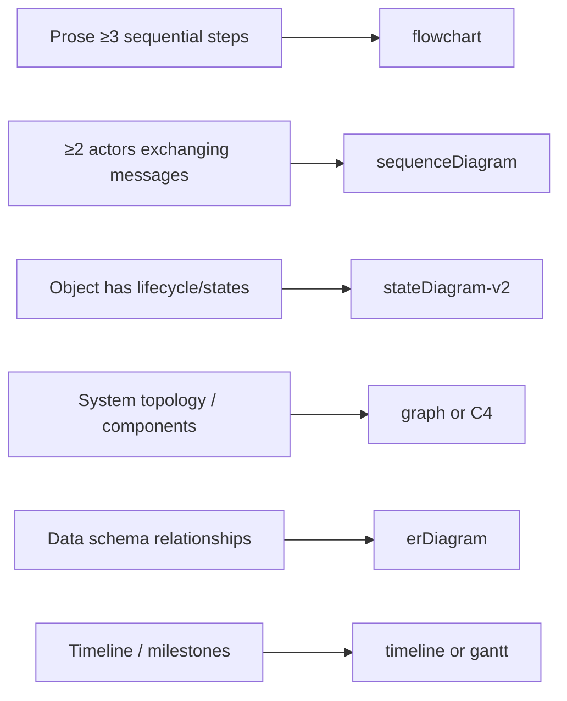

# Write Technical End-User Documentation

Produces layered, audience-aware technical documentation that simultaneously serves:
- **Readers scanning for context**: TL;DR / management summary (30-second read).
- **Users following steps**: practical, actionable procedures.
- **Engineers needing depth**: rationale, design decisions, internals.

## When to Use

- Writing or reviewing a README, user guide, how-to, or reference doc
- Documenting a spec, tool, feature, API, config schema, workflow, or system design
- Creating runbooks, architecture docs, or onboarding guides
- Any documentation where both technical and non-technical stakeholders are consumers

---

## Guidelines

> **Style:** All documentation produced by this skill must conform to the [style-guide.md](./references/style-guide.md). Key rules: imperative voice for procedures, third person for conceptual prose, present tense, Title Case headings, spell out one through nine and use digits for 10+, Oxford comma, no weasel words, no passive voice in steps, no marketing language, no unearned modal hedges.

### Clarify Scope and Audience

Before writing, resolve:

| Question | Why it matters |
|---|---|
| Who is the primary reader? (end-user, engineer, ops, mixed) | Determines depth vs. brevity balance |
| What is their starting knowledge level? | Determines assumed vs. explained context |
| What action or decision does this doc enable? | Drives what to include vs. cut |
| What format/medium? (Markdown, wiki, portal, PDF) | Affects diagram embedding, linking |
| Is there an existing doc to update or a net-new one? | Net-new needs more scaffolding |

If producing for a mixed audience, always layer: summary first, depth after.

---

### Document Structure

Structure the document to suit the content and audience; there is no mandatory template. That said, most technical docs benefit from some combination of these sections, and TL;DR should always come first:

- **TL;DR / Summary**: always first; ≤5 sentences or bullet points.
- **Overview**: what it is, why it exists (rationale).
- **Prerequisites**: what the reader needs before starting.
- **Core content**: how-to, procedures, or reference material (shape this to the topic).
- **Configuration Reference**: if the system is configurable.
- **Troubleshooting**: common failure modes and remediation.
- **Further Reading**: links to related docs, code, RFCs.

---

### TL;DR / Summary

The TL;DR is a **management-level executive summary**: one paragraph or 3–5 bullets. It must answer:
- What is this? (one sentence)
- Why does it exist / what problem does it solve?
- What does the reader need to know to decide whether to read further?

**Rules:**
- No jargon without immediate plain-English gloss
- No implementation detail: only outcomes and intent
- ≤ 5 sentences or bullets
- Written last (after the full doc is drafted), placed first

**Example TL;DR pattern:**
```md
:::info[TL;DR]
[Feature] does X to solve Y. It is used when Z.
Engineers need to [one-sentence config action]. No changes to [common concern, e.g., existing auth].
:::
```

---

### Mermaid Diagrams

Use a diagram when any of the following is true:
- The prose requires 3+ "then ... then ... then" steps (→ flowchart).
- There are 2+ actors exchanging messages (→ sequence diagram).
- There is a state machine or lifecycle (→ state diagram).
- There is a system boundary or component topology (→ C4 or block diagram).
- A table would need a third "relationship" column (→ graph or ER diagram).

See [diagram-guide.md](./references/diagram-guide.md) for patterns and examples.

**Always accompany diagrams with a one-sentence caption** and, where non-obvious, a short "What to notice" callout pointing to the key insight the diagram conveys.

**Diagram types and their triggers:**



---

### Procedures: Actionable and Verifiable

Every procedure step must be:
- **A single action**: one verb, one outcome.
- **Verifiable**: what does success look like? Include expected output/state.
- **Grounded**: reference actual commands, config keys, UI labels verbatim.

**Pattern:**
```md
1. **Open** the configuration file at `config/appsettings.json`.
2. **Set** `Feature:Enabled` to `true`.
3. **Restart** the service: `systemctl restart myapp`.
   - Expected: `systemctl status myapp` shows `Active: active (running)`.
```

**Anti-patterns to avoid:**
- "Configure the settings appropriately": no, specify which settings and to what value.
- "Restart if needed": no, state the condition precisely.
- Steps that do 3 things at once: split them.

---

### Rationale

Add a `:::note[Why?]` admonition when:
- A design choice will surprise the reader.
- There is a non-obvious constraint or trade-off.
- The reader will likely ask "why not just do X instead?"
- A future engineer will be tempted to change a default and shouldn't.

**Format:**
```md
:::note[Why?]
This uses a polling interval of 30 s rather than a webhook because
the upstream API does not support push notifications. If it ever does,
see [issue #42](link) for the migration plan.
:::
```

Do **not** add rationale to self-evident steps. It dilutes the signal.

---

### Callout Hierarchy

Docusaurus renders **admonitions**; use them instead of raw blockquotes. Syntax:

```md
:::type[Optional Title]
Content here.
:::
```

| Admonition | When to use |
|---|---|
| `:::note` | Supplementary context, not required reading |
| `:::tip` | Optional best practice or shortcut |
| `:::info` | Must-read context; important prerequisite or constraint |
| `:::warning` | Risk of data loss, downtime, or security exposure |
| `:::danger` | Irreversible or breaking action; confirm before proceeding |
| `:::note[Why?]` | Rationale for a non-obvious design decision |

Custom titles are encouraged when the generic type name would be ambiguous, e.g., `:::warning Bearer token expiry` is clearer than `:::warning`. Keep titles short and specific.

**Example:**
```md
:::warning Bearer token expiry
Access tokens expire after 300 seconds. Implement proactive refresh
to avoid 401 errors on long-running operations.
:::
```

---

### Configuration Reference

For any configurable system, include a reference table:

```md
| Key | Type | Default | Required | Description |
|-----|------|---------|----------|-------------|
| `Feature:Enabled` | `bool` | `false` | No | Enables the feature globally |
| `Feature:TimeoutMs` | `int` | `5000` | No | Request timeout in milliseconds |
```

Rules:
- Include the **default**; this is the most-read column.
- Note when values are environment-specific (dev vs. prod).
- Cross-link to examples showing values in context.

---

### Troubleshooting

Format each entry as: **symptom → cause → remedy**.

```md
## Troubleshooting

### Service fails to start after upgrade

**Symptom:** `systemctl status myapp` shows `code=exited, status=1/FAILURE`.

**Cause:** Config schema changed in v2.0: the old `Legacy:Key` is no longer valid.

**Remedy:** Remove `Legacy:Key` from `appsettings.json` and restart.
> See [migration guide](./migration-v2.md) for full changelog.
```

---

### Review Checklist

Before finalizing, verify:

- [ ] TL;DR present and answers: what, why, and what-to-do-next.
- [ ] Prerequisites listed with version/permission requirements
- [ ] All steps are atomic, verifiable, and use exact values/commands.
- [ ] Diagrams added where prose would need 3+ sequential "then" steps or 2+ actors
- [ ] All diagrams have captions and "What to notice" for non-obvious ones.
- [ ] Rationale added to non-obvious decisions; not added to self-evident ones
- [ ] Admonitions use Docusaurus `:::type` syntax (not raw blockquotes); types used consistently (`:::danger` ≠ `:::note`)
- [ ] Config reference table includes defaults.
- [ ] Troubleshooting covers the top 3 most likely failure modes.
- [ ] No orphaned jargon: every acronym expanded on first use in TL;DR/Overview; abbreviate freely in technical sections thereafter.
- [ ] Verified all commands/paths/values against actual system (no guessing)
- [ ] Cross-links to related docs, code, issues where relevant
- [ ] Every `.md` file has front matter with at least `title` and `description`
- [ ] No broken internal links: validate with `yarn build` before merging.
- [ ] Generated API MDX files (`*-service/`) not edited directly
- [ ] Style conformance verified against [style-guide.md](./references/style-guide.md)

---

### Docusaurus-Specific Authoring

#### Front Matter

Every `.md` / `.mdx` file must open with YAML front matter. Minimum required fields:

```yaml
---
title: My Page Title          # required, sets <title> and the H1 if no explicit heading
sidebar_label: Short Name     # optional, sidebar label when different from title
sidebar_position: 3           # optional, explicit ordering within a sidebar category
description: One-sentence description for search results and link previews.
---
```

Set `custom_edit_url: null` on generated or auto-maintained pages to suppress the "Edit this page" link.

#### Admonitions with Custom Titles

Prefer a specific title over the generic type name when context allows:

```md
# Too generic; reader must read the body to know what to watch for
:::warning
Tokens expire.
:::

# Descriptive; reader knows immediately what this is about
:::warning Bearer token expiry
Access tokens expire after 300 seconds. Implement proactive refresh
to avoid 401 errors on long-running operations.
:::
```

#### Code Block Enhancements

Docusaurus supports metadata on fenced code blocks; use it:

````md
```bash title="Fetch a token"
curl -X POST https://your-server/auth/.../token \
  -d "client_id=..." -d "grant_type=client_credentials"
```

```json title="Response" {3}
{
  "token_type": "Bearer",
  "access_token": "<JWT>",
  "expires_in": 300
}
```
````

Supported metadata: `title=` (label the block), `showLineNumbers`, `{line-range}` for line highlights (e.g., `{2,4-6}`).

#### Tabs (Multi-Platform Examples)

Use Tabs for showing equivalent steps across platforms, languages, or toolchains:

```mdx
import Tabs from '@theme/Tabs';
import TabItem from '@theme/TabItem';

<Tabs>
  <TabItem value="curl" label="curl" default>
    ```bash
    curl -X GET https://your-server/api/v1/resources
    ```
  </TabItem>
  <TabItem value="python" label="Python">
    ```python
    requests.get("https://your-server/api/v1/resources", headers={...})
    ```
  </TabItem>
</Tabs>
```

MDX imports must appear before any JSX, but after front matter and any `# heading`.

#### Broken Links

`onBrokenLinks: 'throw'` is set in `docusaurus.config.ts`; a broken internal link fails the build:
- Use relative paths (`./other-page`, `../category/page`), not absolute URLs, for cross-doc links.
- Never link directly to generated MDX file paths: link to the rendered URL slug.
- Run `yarn build` to catch broken links before opening a PR.

#### Generated vs. Hand-Written Files

`docs/your-product/*-service/` directories are generated by `docusaurus-plugin-openapi-docs` and overwritten on every `yarn gen-api-docs`. **Do not edit them directly.** To change API page content:
1. Edit the OpenAPI spec in `specs/` or its companion `.md` file.
2. Re-run `yarn clean-api-docs && yarn gen-api-docs`.

Hand-written docs live in `docs/your-product/*.md` and `docs/your-product/sequence-diagrams/`.

#### Versioning Considerations

When a page will be frozen by `create-version.ps1`:
- Avoid phrases like "the current version" or "the latest release"; use explicit version numbers.
- Do not hardcode unversioned spec download paths (`/specs/*.json`): the version script patches them automatically, but only in the frozen snapshot.
- Use an admonition to annotate version-specific content rather than branching prose:

```md
:::info Available from v2.6
This endpoint requires version 2.6 or later.
:::
```

---

## Best Practices

### Audience Layering
Structure docs so each audience can self-navigate:
- **Scanners** (managers, evaluators): TL;DR + Overview → done.
- **Doers** (operators, developers): Prerequisites + Procedures → done.
- **Internals readers** (senior engineers, reviewers): Rationale + Config Reference + Troubleshooting → done.

### Versioning
- Include a **Last updated** date and the software version the doc applies to.
- When breaking changes occur, add a visible admonition at the top:
  ```md
  :::warning Updated for v2.0
  See [migration guide](...) for breaking changes.
  :::
  ```

### Code and Command Formatting
- Always use fenced code blocks with language hints: ` ```json `, ` ```bash `, ` ```yaml `.
- Use inline code for: config keys, file paths, CLI flags, env vars, UI labels.
- Never paraphrase a command: quote it exactly.

### Minimal Viable Doc Principle
A short, accurate, maintained doc beats a long, stale one. When in doubt:
- Write less; link more.
- Cut any sentence that doesn't help the reader act or decide.

### Living Documentation
- Docs should be co-located with code (same repo) where possible.
- Link from code (e.g., `// See docs/feature-x.md`) and from docs to code.
- Outdated docs erode trust faster than missing docs. Prefer a "stub with caveats" over a stale how-to.

### Writing Style
See [style-guide.md](./references/style-guide.md) for the full set of tone, voice, tense, and anti-pattern rules.

---

## References

- [diagram-guide.md](./references/diagram-guide.md): Mermaid patterns, examples, and anti-patterns.
- [style-guide.md](./references/style-guide.md): voice, tone, tense, anti-patterns, and sentence-level rules.
