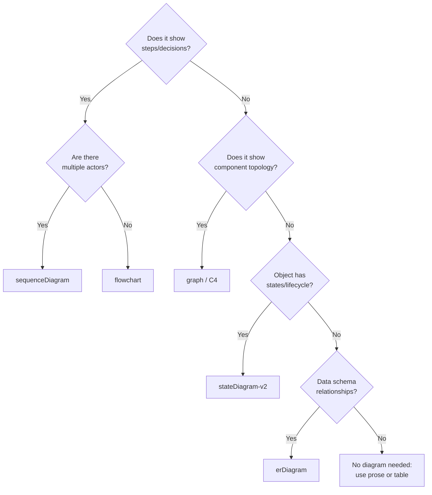

# Mermaid Diagram Guide

For syntax, all diagram types, and a live playground, see the **[official Mermaid docs](https://mermaid.js.org/intro/)**; they are the authoritative, actively maintained reference.

This file covers the opinionated, documentation-context-specific guidance that the official docs don't: when to use each diagram type, captions, "What to notice" callouts, and anti-patterns.

---

## Decision: Which Diagram Type?

---

## When to Use Each Type

| Diagram type | Use when |
|---|---|
| `flowchart` | Prose needs "if … then … else" or ≥ 3 sequential "then" steps |
| `sequenceDiagram` | ≥ 2 actors exchanging messages in order (API calls, auth flows, event chains) |
| `stateDiagram-v2` | An object or resource has a defined lifecycle (jobs, orders, connections) |
| `graph` / C4 | System components, service dependencies, deployment topology |
| `erDiagram` | Data model, schema, or API resource relationships |
| `timeline` / `gantt` | Release milestones, project phases, migration windows |

---

## Caption and "What to Notice" Pattern

Every diagram needs:

1. **Caption** (immediately below): one sentence stating what the diagram shows.
2. **"What to notice"** (optional): a short callout pointing to the non-obvious insight, the part that would surprise a skimming engineer.

\`\`\`markdown
[diagram code]

*Caption: Payment processing flow from checkout to settlement.*

> **What to notice:** The fraud check (step 3) is synchronous and on the hot path;
> p99 latency of the fraud service directly impacts checkout latency.
> See [Performance Considerations](#performance) for mitigation options.
\`\`\`

---

## Anti-Patterns

| Anti-pattern | Problem | Fix |
|---|---|---|
| 15+ nodes in one diagram | Unreadable; loses the "picture = 1000 words" benefit | Split into overview + detail diagrams |
| No caption | Reader must reverse-engineer the intent | Always add a caption sentence |
| Flowchart for a 2-step process | Overkill; a numbered list is clearer | Use a numbered list instead |
| Sequence diagram with 6+ actors | Becomes a wall of arrows | Group actors into subsystems |
| Diagram that duplicates adjacent prose exactly | Redundant; wastes space | Either cut the prose or cut the diagram |
| Generic labels ("System", "Service", "DB") | No information value | Use real component names |
